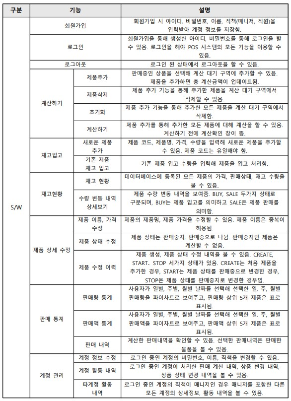

# Convenience-POS-System

**스프링프레임워크(소프트웨어학과전공) 과목 텀프로젝트**

## 프로젝트명  
편의점 POS(Point Of Sale) 시스템

 

## 프로젝트 소개 
스프링부트 프레임워크를 이용한 편의점 POS 시스템 개발. 스프링프레임워크(소프트웨어학과전공) 과목 텀프로젝트

 

## 개발기간

2022.05.09~2022.06.06

 

## 작품 기능

- 계정기능
- 재고관리(입고) 기능
- 판매기능
- 통계기능

 

## 요구사항

- Spring Boot 사용

- Spring MVC를 이용하여 웹버전으로 개발

- 계정정보, 재고정보, 판매정보 등은 MySQL 사용(Spring JDBC 이용)

- Spring Context객체를 사용할 것. (xml 또는 자바설정 방식 선택)

- 주요 객체들간의 dependency를 spring 설정기능을 이용해 constructor/setter injection을 사용하여 연결

- Bean 객체 7개 이상 등록(setter, constructor injection 사용) - **17개 Bean 객체 사용**

- 웹화면은 Thymeleaf 사용

 
 

## 작품 구성도

1) 서비스 구성도

2) 기능 구성도

 
 

## 데이터베이스

**member_tb** : 회원가입 시 회원의 정보를 저장하는 테이블입니다. 회원의 이메일, 비밀번호, 회원 이름, 회원 역할, 회원 등록 날짜가 저장됩니다.

**product_tb** : 상품 정보가 저장되는 테이블입니다. 상품코드, 상품이름, 상품가격, 상품 재고 수량, 현재 판매여부 정보가 저장됩니다.

**product_history_tb** : 상품 수량 변동 내역 기록이 저장되는 테이블입니다. member_tb와 product_tb를 참조하고, 상품이름, 상품가격, 상품 변동 수량, 날짜, 변동 방법이 저장됩니다

**product_state_history_tb** : 상품 상태 변동 내역 기록이 저장되는 테이블입니다. member_tb와 product_tb를 참조하고, 기존 상품이름, 새로운 상품이름, 기존 상품 가격, 새로운 상품 가격, 상태 변동 구분, 날짜가 저장됩니다.

**sale_tb** : 판매 내역이 저장되는 테이블입니다. member_tb를 참조하고, 총 판매가격, 날짜가 저장됩니다.

**sale_detail_tb** : 판매 상세 내역이 저장되는 테이블입니다. sale_tb, product_tb 테이블을 참조하고, 상품이름, 상품 가격, 판매 수량이 저장됩니다.

**sale_cart_tb** : 계산 대기 상품을 저장하는 테이블입니다. member_tb, product_tb를 참조하고, 계산 할 대기 상품 수량을 의미합니다.

 
 

## 기능

 
 

### **기능 - 계정**

---

회원가입 후 로그인을 해야 pos 시스템 이용이 가능합니다. 회원가입 시 직책을 선택할 수 있습니다. 매니저를 선택하면 다른 계정의 활동내역을 확인할 수 있습니다.

계정 관리페이지에서는 현재 로그인한 회원정보 확인, 회원정보 수정, 로그인한 회원이 판매한 내역, 상품 변경(이름, 가격, 수량변동) 내역, 상품 상태 변경(판매재개, 판매중단) 내역을 조회할 수 있습니다.

만약 로그인한 회원 직책이 매니저라면 다른 계정 정보 확인할 수 있습니다. 다른 계정의 판매, 상품변경, 상태변경 내역을 확인할 수 있습니다.

### **기능 - 재고관리**

---

제품입고 페이지에서는 새로운 제품입고, 기존에 등록된 제품 추가하기 기능이 있습니다.

편의점에 등록된 제품에 대해서 판매 중단, 판매 재개 설정이 가능합니다.

제품 판매를 중단하면 판매기능 페이지에서 그 제품을 계산할 수 없습니다.

### **기능 - 판매기능**

---

왼쪽에는 편의점에 등록된 판매가능한 제품 목록이 출력됩니다. 만약 제품 수량과 추가하기 버튼을 클릭하면 오른쪽 구간에 추가한 정보가 추가됩니다. 초기화하기 버튼을 클릭하면 오른쪽 구간에 담아둔 제품을 초기화합니다.

계산하기 버튼을 클릭하면 위 사진처럼 모달창이 뜨고 계산하기 버튼을 클릭하면 판매가 됩니다.

### **기능 - 통계기능**

---

통계페이지에서는 일별, 주별, 월별 판매량, 판매액 제품을 파이차트로 보여주고, 상위 5개 제품을 표로 출력합니다.

날짜를 선택하고 조회하기 버튼을 클릭하면 Ajax통신을 통해 서버로 요청을 하고, 서버에서는 josn 형태로 정보를 응답하고 js를 이용해 차트를 그립니다. 페이지 새로고침 없이 차트가 업데이트됩니다.

판매내역을 표형태로 출력합니다. 상세보기를 클릭하면 위 사진처럼 판매직원 ID, 판매시간, 판매한 물품 상세 정보가 출력됩니다.

## 작품 개발 환경

|OS|개발환경 IDE|개발도구|빌드관리도구|개발언어|형상관리도구|
|---|---|---|---|---|---|
|window11|IntelliJ IDEA 2021.2.2|Spring Boot 2.6.7|Maven|JAVA 11|Github|
 
 

## 의존성

|groupId|artifactId|version|
|-----|-----|-----|
|org.springframework.boot|spring-boot-starter-web|2.6.7|
|org.springframework.boot|spring-boot-starter-test|2.6.7|
|org.springframework.boot|spring-boot-starter-thymeleaf|2.6.7|
|org.springframework.boot|spring-boot-starter-data-jdbc|2.3.4|
|org.springframework.boot|spring-boot-starter-jdbc|2.6.7|
|org.springframework.boot|spring-boot-starter-validation|2.6.7|
|mysql|mysql-connector-java|8.0.28|
|org.apache.tomcat|tomcat-jdbc|9.0.62|
|nz.net.ultraq.thymeleaf|thymeleaf-layout-dialect|3.0.0|
|com.google.code.gson|gson|2.8.7|
|org.hibernate|hibernate-validator|5.2.4.Final|

 
 

## view

1. 부트스트랩 무료 템플릿

https://startbootstrap.com/template/heroic-features

 

2. CSS, JS 라이브러리

|구분|이름|버전|사용방식|
|--|---|---|---|
|CSS|Bootstrap icons|1.4.1|CDN|
|JS|jQuery|3.5.0|CDN|
|JS|gstatic - charts(google chart)|-|CDN|

 
 

## 프로그램 구조

1) java 소스

 

2) view 소스

 
 

## 오픈소스 

1) 테이블 페이징 구현

 https://codepen.io/jaehee/pen/mRmNEX
 
 위 사이트의 소스코드를 기반으로 테이블 페이징을 구현했습니다. 

 
 

## 기타

1. 로그

스프링 인터셉터를 이용해 로그를 기록하게 함. logs 폴더에 일 단위로 로그 파일이 
생성됨. 
